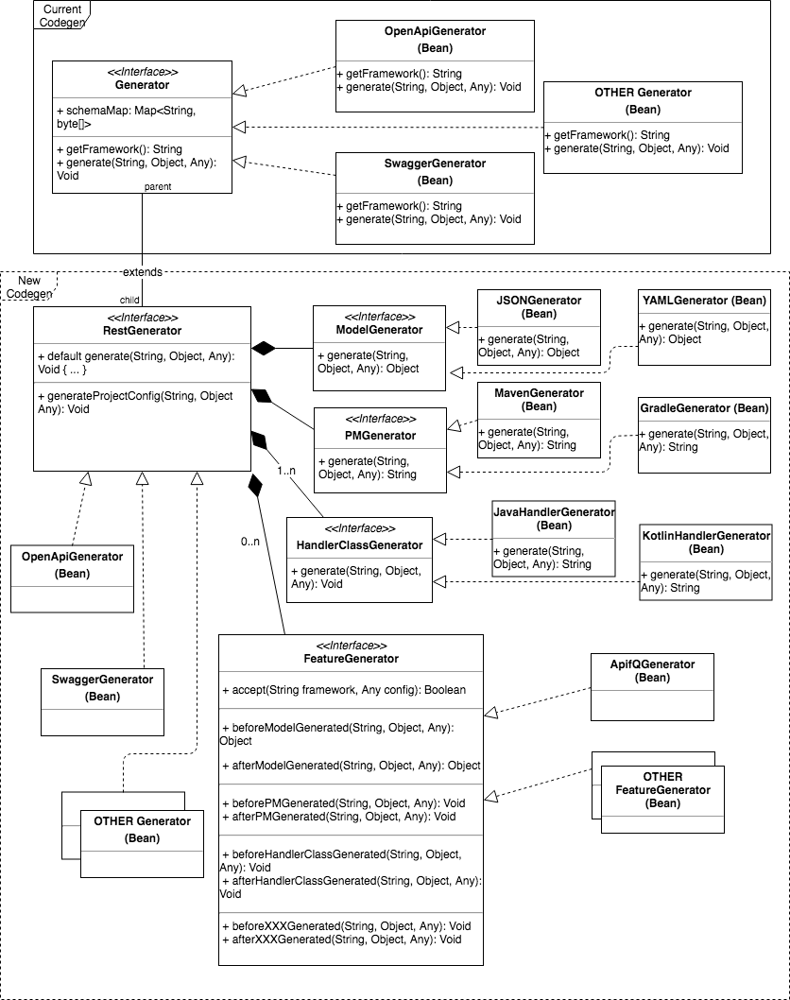

### Summary

The current code generation is built on framework such as, OpenAPI, Swagger, Hybrid, Eventuate, and etc. Each of the frameworks represents the list of files to be generated in different flavors according to configurations and input data (model).

There are two limitations in this approach:

1. Even if some common logics that can be shared across frameworks, there is no easy way for the framework implementations to do so instead of having to start everything from scratch.

2. When addtional features are required to the existing framework generators, there is no way to make these features plugable to generator instead of having to create a new "framework" generator to add them in.

### Motivation

APIF-Q is an interface provided to have a unique way to send and receive messages for the services created based on APIF.
As part of the APIF-Q's features, the code generator should inject the new APIF-Q snippets into the service codes as well as modifying or adding configurations files related.

To resolve the two limitations mentioned in the [Summary](#Summary), the generator required for APIF-Q should not be implemented as an individual framework, but a feature that can be applied to existing or new framework.
For an example, we can have both OpenAPI, Swagger to support code generated with APIF-Q code snippets and config files.

Feature generators should be able to modify existing and add config files as well as inject example API code snippets into existing service codes.

### Guide-level explanation

The following diagram describe the high level design of the proposed codegen structure.


### Reference-level explanation
To register the generators, we need to put the generator beans in the service.yml. The following is an example.

```$xslt
singletons:
  - com.networknt.codegen.Generator:
    - com.networknt.codegen.rest.OpenApiGenerator
    - com.networknt.codegen.rest.SwaggerGenerator
  - com.networknt.codegen.ModelGenerator:
    - com.networknt.codegen.model.JSONGenerator
  - com.networknt.codegen.PMGenerator:
    - com.networknt.codegen.pm.MavenGenerator
  - com.networknt.codegen.HandlerClassGenerator:
    - com.networknt.codegen.rest.JavaHandlerGenerator
  - com.networknt.codegen.FeatureGenerator
      - com.cibc.apif.queue.codegen.ApifQGenerator        
```

### Drawbacks


### Rationale and Alternatives


### Unresolved questions
